# FitForge-AI (Astraa) Internal API Route Map

This document outlines all currently mapped backend Express routes, including methods, full paths, assigned middlewares, controllers, and applicable parameters across all modules configured in your REST API. It is tailored for helping formulate Postman requests quickly.

## Module to Route Hierarchy Diagram

```mermaid
graph TD
    API[/api/]
    
    API --> AUTH[\auth\]
    AUTH --> |POST| A_Register( /register)
    AUTH --> |POST| A_Login( /login)
    AUTH --> |POST| A_Logout( /logout)
    AUTH --> |POST| A_Refresh( /refresh)
    AUTH --> |GET| A_Me( /me)
    AUTH --> |POST| A_Guest( /guest)
    AUTH --> |DELETE| A_Guest_Del( /guest/:id)
    
    API --> USER[\user\]
    USER --> |GET| U_Me( /me)
    USER --> |PUT| U_Onboard( /onboard)
    USER --> |PUT| U_IntroComplete( /intro-complete)
    
    API --> PROF[\profiles\]
    PROF --> |GET, POST| P_Root( /)
    PROF --> |DELETE| P_Bulk( /bulk-cleanup)
    PROF --> |GET, PUT, DELETE| P_Id( /:id)
    PROF --> |POST| P_IdSelect( /:id/select)
    PROF --> |POST| P_IdVerify( /:id/verify-pin)
    PROF --> |POST| P_IdSelectA( /:id/select-account)
    PROF --> |POST| P_IdVerifyA( /:id/verify-pin-account)
    
    API --> BMI[\bmi\]
    BMI --> |GET| B_Root( /)
    BMI --> |POST| B_Calc( /calculate)
    BMI --> |GET| B_History( /history)
    
    API --> NUTRITION[\nutrition\]
    NUTRITION --> |GET, POST| N_Log( /log)
    NUTRITION --> |PUT, DELETE| N_LogId( /log/:id)
    NUTRITION --> |POST| N_Up( /upload)
    
    API --> DIET[\diet\]
    DIET --> |GET| D_Plan( /plan)
    DIET --> |POST| D_Gen( /generate)
    
    API --> RECIPES[\recipes\]
    RECIPES --> |GET| R_Root( /)
    RECIPES --> |POST| R_Ex( /from-excel)
    
    API --> WRK[\workout\]
    WRK --> |GET| W_Plan( /plan)
    WRK --> |POST| W_Gen( /generate)

    API --> MACHINE[\machine\]
    MACHINE --> |POST| M_Boot( /boot)
    MACHINE --> |POST| M_Sess( /session)
    MACHINE --> |POST| M_Form( /form)
    MACHINE --> |GET| M_Sesss( /sessions)
    
    API --> AI[\ai\]
    AI --> |GET| AI_Recs( /recommendations)
    AI --> |POST| AI_Ana( /analyze)
```

 

---

## Complete API Route List by Module

All of these routes reside under the base path **`http://localhost:XXXX/api`**.

### 1. Root & Health Check (`src/app.js`)
| Method | Full Path | Middlewares | Controller / Target |
|---|---|---|---|
| GET | `/api/health` | *(global rate limiter)* | `inline handler` |

### 2. Auth Module (`src/modules/auth/auth.routes.js`)
*Controllers handled by `auth.controller.js`*

| Method | Full Path | Middlewares | Controller / Handler |
|---|---|---|---|
| POST | `/api/auth/register` | `authLimiter` | `register` |
| POST | `/api/auth/login` | `authLimiter` | `login` |
| POST | `/api/auth/logout` | *(none)* | `logout` |
| POST | `/api/auth/refresh` | *(none)* | `refresh` |
| GET | `/api/auth/me` | `authenticate` | `getMe` |
| POST | `/api/auth/guest` | `authenticateMachine` | `createGuestSession` |
| DELETE | `/api/auth/guest/:id` | `authenticateGuest` (param: `:id`) | `endGuestSession` |

### 3. User Module (`src/modules/user/user.routes.js`)
*Controllers handled by `user.controller.js`*

| Method | Full Path | Middlewares | Controller / Handler |
|---|---|---|---|
| GET | `/api/user/me` | `authenticate` | `getMe` |
| PUT | `/api/user/onboard` | `authenticate` | `onboard` *(Returns deprecation msg)* |
| PUT | `/api/user/intro-complete` | `authenticate` | `markIntroComplete` |

### 4. Profiles Module (`src/modules/profile/profile.routes.js`)
*Controllers handled by `profile.controller.js`*

| Method | Full Path | Middlewares | Controller / Handler |
|---|---|---|---|
| GET | `/api/profiles` | `authenticate` | `getProfiles` |
| POST | `/api/profiles` | `authenticate` | `createProfile` |
| DELETE | `/api/profiles/bulk-cleanup` | `authenticate` | `deleteBulkProfiles` |
| GET | `/api/profiles/:id` | `authenticateAny` (param: `:id`) | `getProfileById` |
| PUT | `/api/profiles/:id` | `authenticate` (param: `:id`) | `updateProfile` |
| DELETE | `/api/profiles/:id` | `authenticate` (param: `:id`) | `deleteProfile` |
| POST | `/api/profiles/:id/select` | `authenticateMachine` (injects userId) | `selectProfile` |
| POST | `/api/profiles/:id/verify-pin` | `authenticateMachine` (injects userId) | `verifyPin` |
| POST | `/api/profiles/:id/select-account` | `authenticate` (param: `:id`) | `selectProfile` |
| POST | `/api/profiles/:id/verify-pin-account` | `authenticate` (param: `:id`) | `verifyPin` |

### 5. BMI Module (`src/modules/bmi/bmi.routes.js`)
*Controllers handled by `bmi.controller.js`*

| Method | Full Path | Middlewares | Controller / Handler |
|---|---|---|---|
| GET | `/api/bmi` | `authenticateProfile` | `getBMI` |
| POST | `/api/bmi/calculate` | `authenticateProfile` | `calculateAndSaveBMI` |
| GET | `/api/bmi/history` | `authenticateProfile` | `getBMIHistory` |

### 6. Workout Module (`src/modules/workout/workout.routes.js`)
*Controllers handled by `workout.controller.js`*

| Method | Full Path | Middlewares | Controller / Handler |
|---|---|---|---|
| GET | `/api/workout/plan` | `authenticateProfile` | `getWorkoutPlan` |
| POST | `/api/workout/generate` | `authenticateProfile` | `generateWorkoutPlan` |

### 7. Diet Module (`src/modules/diet/diet.routes.js`)
*Controllers handled by `diet.controller.js`*

| Method | Full Path | Middlewares | Controller / Handler |
|---|---|---|---|
| GET | `/api/diet/plan` | `authenticateProfile` | `getDietPlan` |
| POST | `/api/diet/generate` | `authenticateProfile` | `generateDietPlan` |

### 8. Nutrition Logging Module (`src/modules/nutrition/nutrition.routes.js`)
*Controllers handled by `nutrition.controller.js`*

| Method | Full Path | Middlewares | Controller / Handler |
|---|---|---|---|
| GET | `/api/nutrition/log` | `authenticateProfile` | `getFoodLog` |
| POST | `/api/nutrition/log` | `authenticateProfile` | `addManualEntry` |
| POST | `/api/nutrition/upload` | `authenticateProfile`, `upload.single('food_image')` | `uploadFoodImage` (form-data: `food_image`) |
| PUT | `/api/nutrition/log/:id` | `authenticateProfile` (param: `:id`) | `updateFoodLog` |
| DELETE | `/api/nutrition/log/:id`| `authenticateProfile` (param: `:id`) | `deleteFoodLog` |

### 9. Recipes Module (`src/modules/recipes/recipes.routes.js`)
*Controllers handled by `recipes.controller.js`*

| Method | Full Path | Middlewares | Controller / Handler |
|---|---|---|---|
| GET | `/api/recipes` | `authenticateProfile` | `getRecipesByIngredients` (query: `?ingredients=...`) |
| POST | `/api/recipes/from-excel` | `authenticateProfile`, `upload.single('file')` | `getRecipesFromExcel` (form-data: `file`) |

### 10. Machine Interfacing Module (`src/modules/machine/machine.routes.js`)
*Controllers handled by `machine.controller.js`*

| Method | Full Path | Middlewares | Controller / Handler |
|---|---|---|---|
| POST | `/api/machine/boot` | `authenticateMachine` | `bootMachine` |
| POST | `/api/machine/session` | `authenticateMachine` | `ingestSession` |
| POST | `/api/machine/form` | `authenticateMachine` | `ingestFormData` |
| GET | `/api/machine/sessions` | `authenticateProfile` | `getSessions` |

### 11. AI Inference Module (`src/modules/ai/ai.routes.js`)
*Controllers handled by `ai.controller.js`*

| Method | Full Path | Middlewares | Controller / Handler |
|---|---|---|---|
| GET | `/api/ai/recommendations` | `authenticateProfile` | `getRecommendations` |
| POST | `/api/ai/analyze` | `authenticateProfile` | `analyzeAndRecommend` |

---
*Note: Depending on the middleware applied, you must populate Postman's `Authorization` header with `Bearer <AccountJWT>`, `Bearer <ProfileJWT>`, or `Bearer <GuestJWT>`. For routes marked with `authenticateMachine`, supply the `x-machine-token` header instead.*
